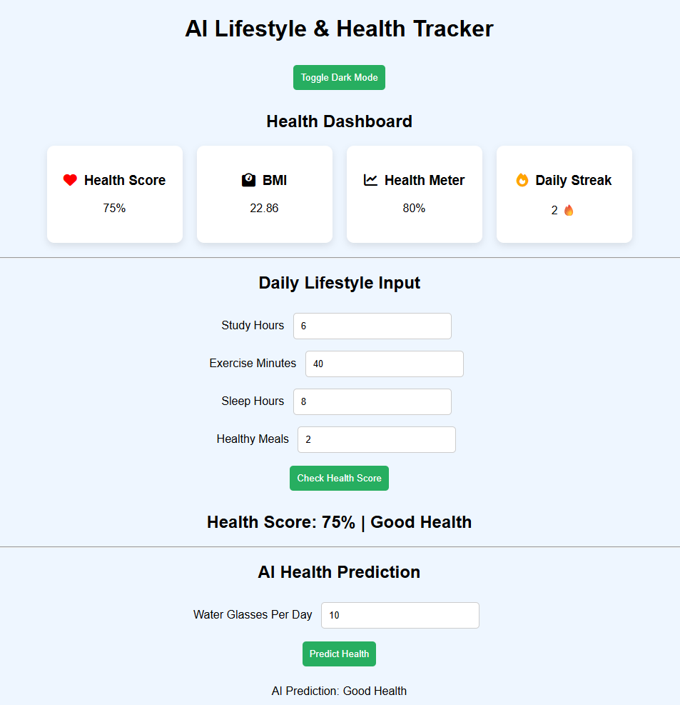
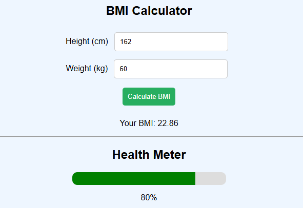
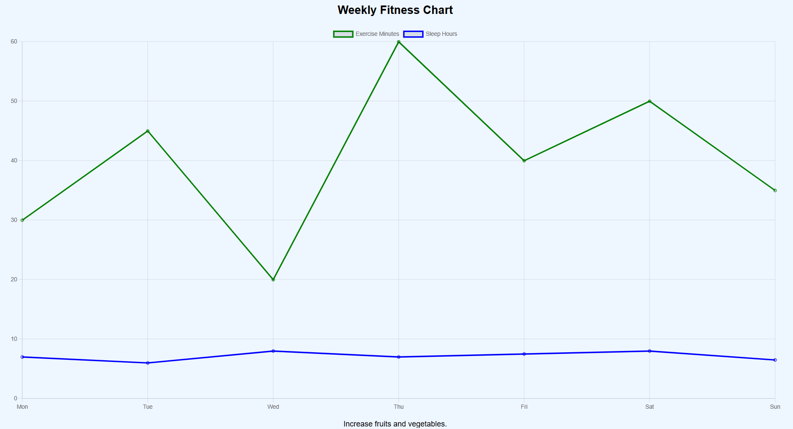

# 🧠 AI Lifestyle & Health Tracker

A mini web application that analyzes daily lifestyle habits and predicts overall health status.

## 🚀 Features

✔ Health Score based on lifestyle inputs  
✔ AI-based Health Prediction  
✔ BMI Calculator  
✔ Weekly Fitness Chart using Chart.js  
✔ Visual Health Meter  
✔ Daily Streak Tracker  
✔ Dark Mode support  

## 🛠 Technologies Used

- HTML
- CSS
- JavaScript
- Chart.js

## 📊 How It Works

1. User enters daily lifestyle data:
   - Study hours
   - Exercise minutes
   - Sleep hours
   - Healthy meals
   - Water intake

2. The system analyzes the inputs using simple AI logic.

3. The application then displays:
   - Health Score
   - AI Health Prediction
   - BMI result
   - Weekly fitness chart
   - Health meter visualization

## 📷 Project Preview

### Dashboard

### AI Prediction

### Weekly Chart

## 📁 Project Files

index.html  
style.css  
script.js

## 💡 Purpose of the Project

This mini project demonstrates how web technologies can be used to build an interactive health tracking application with simple AI-based predictions.

